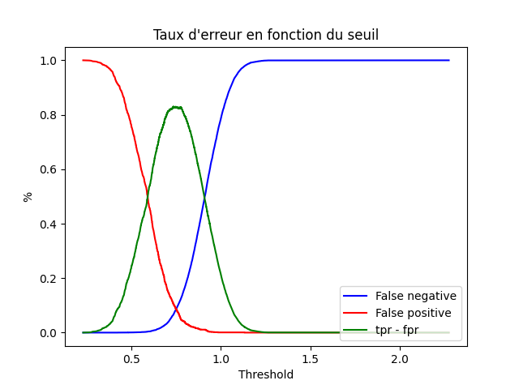

## Reconnaissance du locuteur

Dans les problèmes de reconnaissance de lococuteur (reco loc en plus court), nous cherchons à comparer deux fichiers audio pour determiner s'il appartiennent au même locuteur.

Pour se faire, nous utilisons un réseau de neurone permettant de transformer un signal audio (aussi appellé *session* ou *utterence*) en un embeddings nommé x-vecteur. 

### Fichiers utilisés

Lors de la phase de test du modèle, nous utilisons plusieurs type de fichiers:
 - des fichiers contenants les correspondance x-vecteurs <=> session (`data/xv/enroll.txt` et `data/xv/test.txt`)
 - des fichiers de trials utilisé pour calculer le taux d'erreur d'un système (`data/trial`).
 
Ces fichiers de trials contiennent sur chaque ligne deux sessions et `target` s'il partagent le meme locuteur, `nontarget` sinon. (cf [FAQ](#Pourquoi-avoir-séparé-les-xv-en-enroll-et-test-?) pour plus d'info)

Exemple de contenu d'un fichier de trials :
```
session123 session321 nontarget
session69 session420 target
```

### Distances

Pour prédire si deux xv partagent le meme locuteur, les x-vecteurs sont comparés en utilisant une distance (euclidienne, cosine, ...). Une distance faible signifie que les xvecteurs, et donc les signaux, appartiennent au meme locuteurs. Ainsi, un seuil (threshold) doit etre trouvé :
 - Une distance inférieure à ce seuil signifie un locuteur commun.
 - Une distance supérieure au seuil signifie des locuteurs différents.

Le modèle ayant généré les xv utilisé dans ce TP utilise une distance **cosine**. Nous allons donc utiliser cette distance pour la suite.

### Determiner le seuil

Ceci est réalisé dans le script `threshold.py`. Allez voir c'est commenté 😉.

Pour determiner le seuil, nous comparons les taux de faux positifs (fpr) et de faux négatif (fnr) pour toutes les valeurs de threshold envisageable. Le croisement des courbes de fpr et fnr nous donnent le threshold optimal (Rq : Ceci revient à trouver le max de la fonction tpr - fpr). Le taux d'erreur obtenu avec ce threshold est nommé EER pour equal error rate.

La commande
```
python threshold.py --trial data/trial --test data/xv/test.txt --enroll data/xv/enroll.txt
```

fournit l'image suivante :



Pour notre  problème, nous trouvons donc un seuil de 0.73. Avec ce seuil, nous obtenons 93% d'accuracy sur `data/trials`.

### Prise de décision

Avec le seuil calculé, la prise de décision est simple :

```python
def decision(xv1, xv2, e=0.73):
    """ Retourne True si les 2 xv partagent le meme locuteur, False sinon """
    return True if np.abs(cosine(xv1,xv2)) <= e else False
```

## Counterfactual Analysis

Nous cherchons ici si un élément d'un xv porte une information, qui si elle se trouve changée, la décision changerais avec. Nous allons donc utiliser différentes distortion pour changer ces éléments, et voir quelles parties du xv sont plus robuste au variations.

### Distortion 1

Ceci est réalisé dans le script `distortion1.py`. Allez voir c'est commenté 😉.

Dans cette distortion, nous raproche un element i de X vers l'element correspondant de Y.
Comme on peut le voir, initialement, la distance cosine étant supérieure à 0.73, la decsion est False signifiant un prédiction de locuteurs différents. 

Pour des locuteurs differents, les valeurs se rapprochent jusqu'a devenir égales, pourtant, la decision ne change jamais :
```
python distortion1.py data/duos/dif_loc
```
Resultat : 
```
X[i]=0.0575642786 Y[i]=0.0667810355 cosine=0.7892572028 decision=False
X[i]=0.0621726570 Y[i]=0.0667810355 cosine=0.7890076546 decision=False
X[i]=0.0644768463 Y[i]=0.0667810355 cosine=0.7888846060 decision=False
X[i]=0.0656289409 Y[i]=0.0667810355 cosine=0.7888235134 decision=False
X[i]=0.0662049882 Y[i]=0.0667810355 cosine=0.7887930752 decision=False
X[i]=0.0664930118 Y[i]=0.0667810355 cosine=0.7887778831 decision=False
X[i]=0.0666370237 Y[i]=0.0667810355 cosine=0.7887702938 decision=False
X[i]=0.0667090296 Y[i]=0.0667810355 cosine=0.7887665008 decision=False
X[i]=0.0667450325 Y[i]=0.0667810355 cosine=0.7887646047 decision=False
X[i]=0.0667630340 Y[i]=0.0667810355 cosine=0.7887636568 decision=False
X[i]=0.0667720347 Y[i]=0.0667810355 cosine=0.7887631829 decision=False
X[i]=0.0667765351 Y[i]=0.0667810355 cosine=0.7887629459 decision=False
X[i]=0.0667787853 Y[i]=0.0667810355 cosine=0.7887628274 decision=False
X[i]=0.0667799104 Y[i]=0.0667810355 cosine=0.7887627682 decision=False
X[i]=0.0667804729 Y[i]=0.0667810355 cosine=0.7887627386 decision=False
X[i]=0.0667807542 Y[i]=0.0667810355 cosine=0.7887627238 decision=False
X[i]=0.0667808948 Y[i]=0.0667810355 cosine=0.7887627164 decision=False
X[i]=0.0667809652 Y[i]=0.0667810355 cosine=0.7887627127 decision=False
X[i]=0.0667810003 Y[i]=0.0667810355 cosine=0.7887627108 decision=False
X[i]=0.0667810179 Y[i]=0.0667810355 cosine=0.7887627099 decision=False
X[i]=0.0667810267 Y[i]=0.0667810355 cosine=0.7887627094 decision=False
X[i]=0.0667810311 Y[i]=0.0667810355 cosine=0.7887627092 decision=False
X[i]=0.0667810333 Y[i]=0.0667810355 cosine=0.7887627091 decision=False
X[i]=0.0667810344 Y[i]=0.0667810355 cosine=0.7887627090 decision=False
X[i]=0.0667810349 Y[i]=0.0667810355 cosine=0.7887627090 decision=False
X[i]=0.0667810352 Y[i]=0.0667810355 cosine=0.7887627090 decision=False
X[i]=0.0667810353 Y[i]=0.0667810355 cosine=0.7887627090 decision=False
X[i]=0.0667810354 Y[i]=0.0667810355 cosine=0.7887627090 decision=False
X[i]=0.0667810354 Y[i]=0.0667810355 cosine=0.7887627090 decision=False
X[i]=0.0667810355 Y[i]=0.0667810355 cosine=0.7887627090 decision=False
X[i]=0.0667810355 Y[i]=0.0667810355 cosine=0.7887627090 decision=False
```

Pour le meme locuteur, les valeurs s'éloignent jusqu'à l'infini, faisant ainsi croitre la distance, changeant donc la décision :
```
python distortion1.py data/duos/same_loc
```
Resultat : 
```
X[i]=-0.0162537054 Y[i]=-0.0031001409 cosine=0.6207446458 decision=True
X[i]=-0.0228304876 Y[i]=-0.0031001409 cosine=0.6207729935 decision=True
X[i]=-0.0326956610 Y[i]=-0.0031001409 cosine=0.6208462186 decision=True
X[i]=-0.0474934211 Y[i]=-0.0031001409 cosine=0.6210249640 decision=True
X[i]=-0.0696900612 Y[i]=-0.0031001409 cosine=0.6214472457 decision=True
X[i]=-0.1029850213 Y[i]=-0.0031001409 cosine=0.6224231439 decision=True
X[i]=-0.1529274616 Y[i]=-0.0031001409 cosine=0.6246358399 decision=True
X[i]=-0.2278411219 Y[i]=-0.0031001409 cosine=0.6295350357 decision=True
X[i]=-0.3402116125 Y[i]=-0.0031001409 cosine=0.6399611057 decision=True
X[i]=-0.5087673482 Y[i]=-0.0031001409 cosine=0.6605809307 decision=True
X[i]=-0.7616009519 Y[i]=-0.0031001409 cosine=0.6964204397 decision=True
X[i]=-1.1408513575 Y[i]=-0.0031001409 cosine=0.7476976201 decision=False
```
Cette méthode n'a marchée que pour les couples de veteurs partageant le meme locuteur. Effectivement, meme avec un seul element, nous pouvons agrandir la distance fortement, mais pas beaucoup la réduire.

## FAQ

### Pourquoi avoir séparé les xv en enroll et test ?

Deux types de fichiers trials existe. Les trials de type `session session target` et ceux de type `locuteur session target` ou locuteur est la moyenne des xv des sessions appartenant a ce locuteur.
Ainsi, le fichier `enroll.txt` contiens les xv pour representer les locuteurs, et `test.txt` contient les xv pour representer les sessions.

Il est plus simple de travailler avec des trials `session session target`, car nous pouvons nous passer d'un calcul de moyenne.

### Le fichier `data/trials` a-t-il été fournit dans le TP ?

Non.
